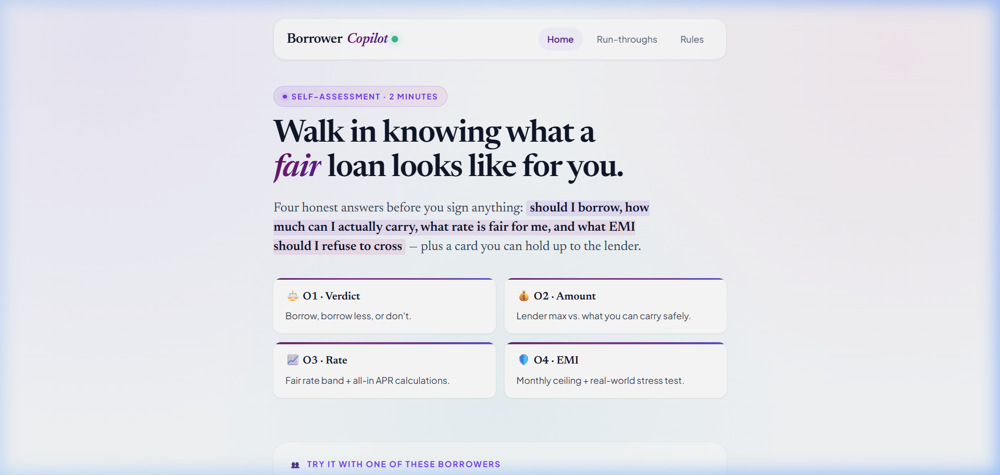
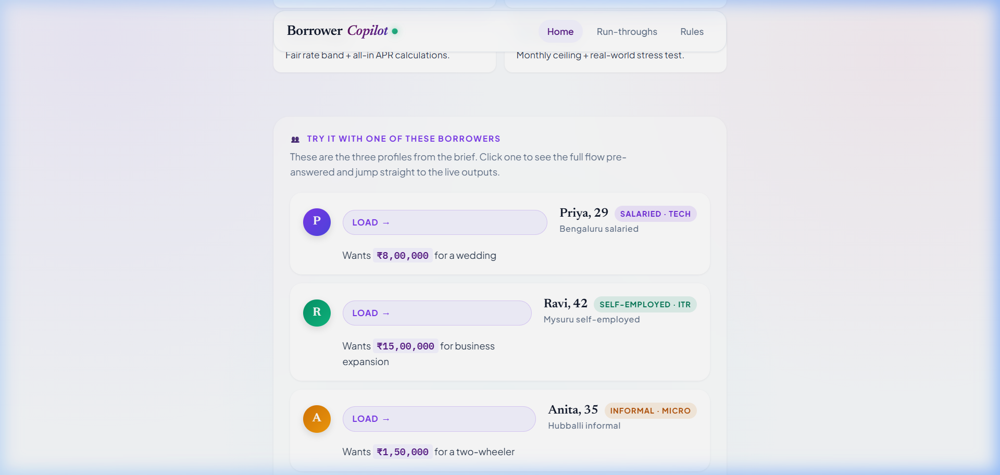
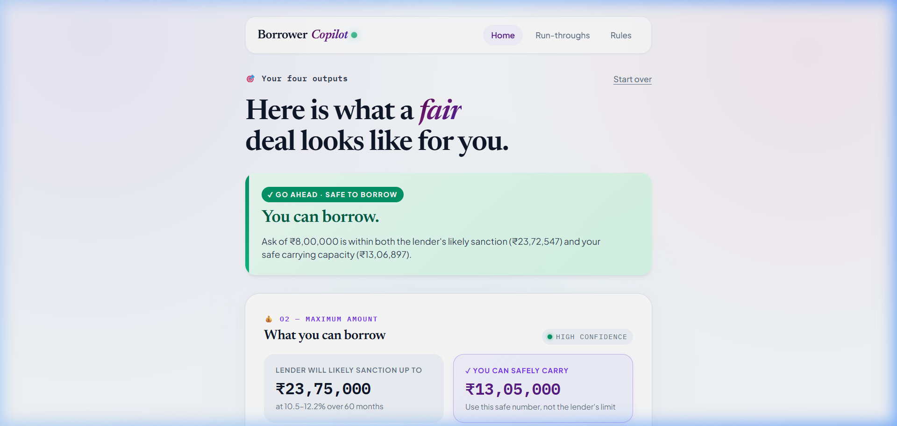
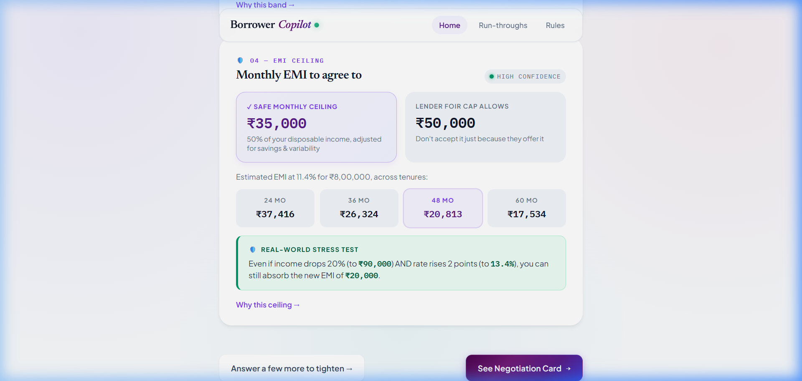
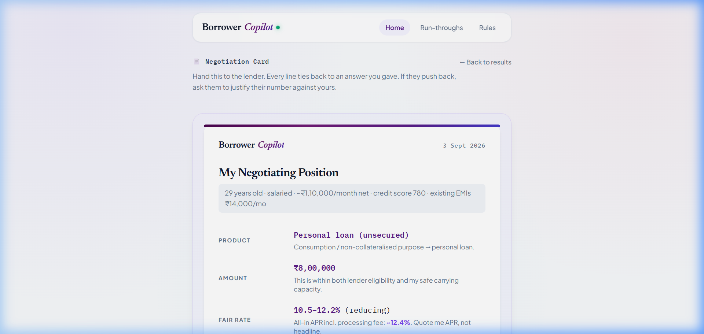
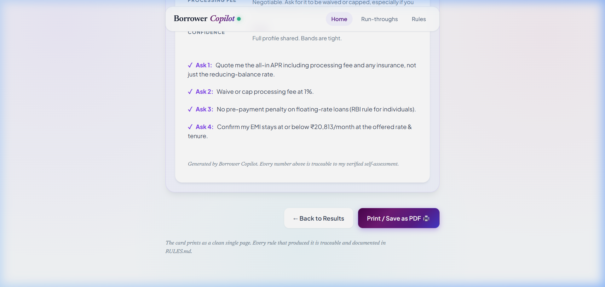
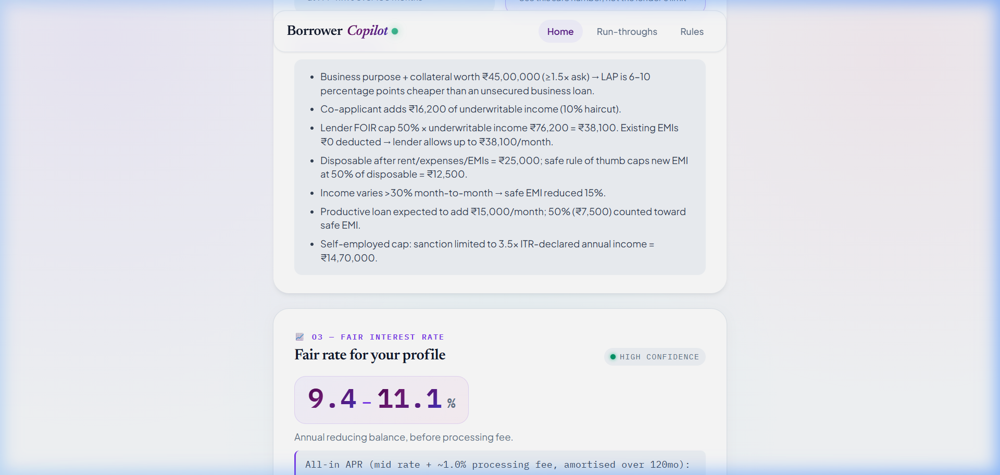
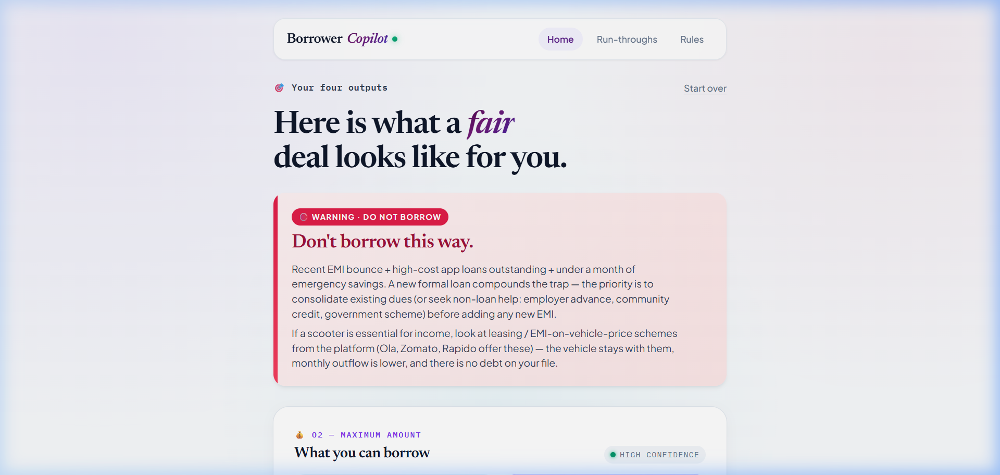
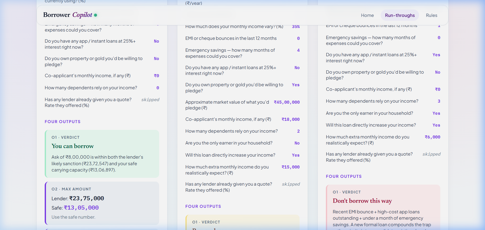

# Borrower Copilot — Complete Walkthrough & Demo

*Deliverable 4. A written five-minute tour of what was built, why, visual UI walkthrough, what to build next, and what to cut.*

---

## 1. What This Is

A rules-based self-assessment for Indian retail borrowers. Answer 8–10 questions minimum (more optional, each earns its place), and get four actionable outputs plus a single-page card to negotiate with lenders. Everything runs 100% in the browser with no backend, no login, and no data tracking.

### The Four Outputs (Mapped to the Brief)

- **O1 · Verdict** — Borrow / Borrow less / Don't. "Don't" is reachable and has diagnostic priority ordering so the borrower gets an actionable reason, not just "safe EMI is small."
- **O2 · Amount** — Two numbers, clearly separated: what the **lender will likely sanction** vs. what you can **safely carry**. The safe number is highlighted with "use this number."
- **O3 · Rate** — A rate band (not a misleading single point), plus true all-in APR including processing fees, with explicit instructions: *"Ask the lender to quote APR, not headline."*
- **O4 · EMI** — Monthly ceiling, tenure trade-offs, and a real-world stress test (income −20%, rate +200bps) testing if the loan holds.

Plus the **Negotiation Card**: a single-page, print-optimised executive sheet with four scripted asks to make of the lender.

---

## 2. Visual Walkthrough & UI Highlights

### Landing Screen & Output Previews

The landing screen introduces the four core outputs and allows immediate loading of the three benchmark borrower profiles.

---

## 3. The Three Borrowers, In One Line Each

- **Priya** (salaried, 780 score) → *"You can borrow."* Personal loan at 10.5–12.1% (APR ~12.4%), ₹8L is well within her safe carrying capacity of ₹13.05L. Lender will offer up to ₹23.75L; the card explicitly tells her not to take the lender's excess sanction.
- **Ravi** (self-employed ITR, no score, ₹45L shop) → *"Borrow less."* Routes to LAP at 9.4–11.1% (APR ~10.5%) instead of unsecured business loan at 20%. ITR cap binds sanction at ₹14.7L, not FOIR. That routing decision alone saves him ~₹8–10 lakh over the loan lifecycle.
- **Anita** (informal, 1 bounce, high-cost app loans, no savings) → *"Don't borrow this way."* The diagnostic debt-trap check fires *before* numeric limits, giving an actionable reason plus a constructive alternative (platform electric vehicle lease).

---

## 4. Detailed Persona Run-Throughs

### Priya — Salaried MNC Borrower
- **O1 Verdict**: Green status badge `✓ GO AHEAD · SAFE TO BORROW`.
- **O2 Amount Comparison**: Highlights ₹13,05,000 Safe Carry vs. ₹23,75,000 Lender Sanction.
- **O3 Rate Band**: 10.5%–12.1% (APR ~12.4%).
- **O4 EMI & Stress Test**: ₹35,000/mo safe ceiling. Stress test passes with headroom.

### The Negotiation Card
A clean executive sheet equipped with 4 scripted lender asks:

---

### Ravi — Self-Employed with Shop Collateral
- **Routing**: Automatically routed to **Loan Against Property (LAP)** at **9.4%–11.1%** instead of unsecured business at **20%+**.
- **ITR Cap**: Capped by 3.5× annual ITR rule at ₹14.7L rather than FOIR.

---

### Anita — Informal / Gig Worker with High-Cost Debt
- **Diagnostic Priority**: The debt-trap check (bounce + app loans + 0 savings) fires first.
- **Constructive Advice**: Directs borrower toward platform electric scooter leasing rather than high-cost 30%+ app debt.

---

### Side-by-Side Run-Throughs (`Run-throughs.html`)
Live computation across Priya, Ravi, and Anita:

---

## 5. What Good Looks Like — Rubric Breakdown

**Domain reasoning (30 pts)**
- Separate computation of lender max sanction (FOIR) vs. safe carrying capacity (50% disposable surplus adjusted for volatility and emergency buffer).
- Anita's diagnostic debt-trap rule takes precedence over numeric gates.
- Ravi's automatic routing to LAP based on collateral cover ≥ 1.5× ask.
- True APR solved from net disbursed cash flows including processing fees.

**Question design (20 pts)**
- 8 core must-questions (9 if score known) produce functional baseline outputs.
- Additional questions use `askIf` predicates (salaried never sees ITR history; gig never sees corporate tiers).
- Visual "Tightens: [output]" pill on every question.
- "Unknown is never zero" applied to unverified scores.

**Explainability & the Card (20 pts)**
- "Why these numbers →" expandable drawer on every output card.
- Collapsible rule trace detailing all rules that fired.
- Negotiation Card formatted for in-branch negotiation.

**Product craft (15 pts)**
- Mobile-first, responsive single-column layout.
- Ranges displayed honestly as bands with clear confidence tags (`High` / `Medium` / `Low`).
- Keyboard shortcuts (`Enter`), Back navigation, and "I don't know" options.

**Engineering (10 pts)**
- `rules.js`: Pure functions, zero DOM dependencies, complete `WHY_` docstrings.
- `questions.js`: Adaptive question array with weight and predicate definitions.
- `app.js`: Clean presentation controller and local storage session persistence.
- `RULES.md`: English mirror of all code rules and constants.

**Honesty about limits (5 pts)**
- Section 11 of `RULES.md` lists all heuristic assumptions and unknown bounds.
- Confidence automatically degrades to "Low" when non-core questions are skipped.

---

## 6. What I'd Build Next (Prioritized)

1. **Tunable Stress-Test Slider**: Allow borrowers to dynamically test scenarios: *"What if I lose my job for 3 months?"* or *"What if expenses rise 25%?"*
2. **Debt Consolidation Mode**: For profiles like Anita, calculate if a lower-cost consolidation loan (e.g. 18%) to pay off 30%+ app loans is viable.
3. **Live Quote Comparison**: Paste a lender's sanction letter (rate, fee, insurance) to calculate exact rupee overpayment against the fair benchmark.
4. **Vernacular Languages**: Hindi, Kannada, Tamil, Telugu, and Marathi localization.
5. **Shareable URL Hash**: Encode state into a URL hash (`#state=...`) for sharing without backend storage.
6. **Account Aggregator (AA) Integration**: Optional auto-fetching of verified bank statements to tighten confidence instantly.

---

## 7. What I Would Cut

- **Low-Impact Questions**: Questions like `dependents` and `soleEarner` adjust safe EMI by only ~15% and could be pruned for a leaner questionnaire.
- **Rule Trace Collapsible**: Move developer-level rule traces behind a debug flag in production.
- **Overly Directive Verdicts**: Soften specific brand mentions (e.g. Zomato lease) into general category recommendations.

---

## 8. How to Defend / Modify Any Rule Live

All underwriting logic resides in:
- `rules.js` — All thresholds, constants, and pure calculation functions.
- `questions.js` — The question bank and `askIf` rules.

*Example Live Edits:*
- **Change informal worker FOIR cap from 40% to 35%**: Modify `FOIR.informal` in `rules.js`, refresh, and Anita's sanction reduces immediately.
- **Add a personal loan cap of 10× monthly income**: Add a single `Math.min(sanction, income * 10)` constraint inside `decideVerdict`.
